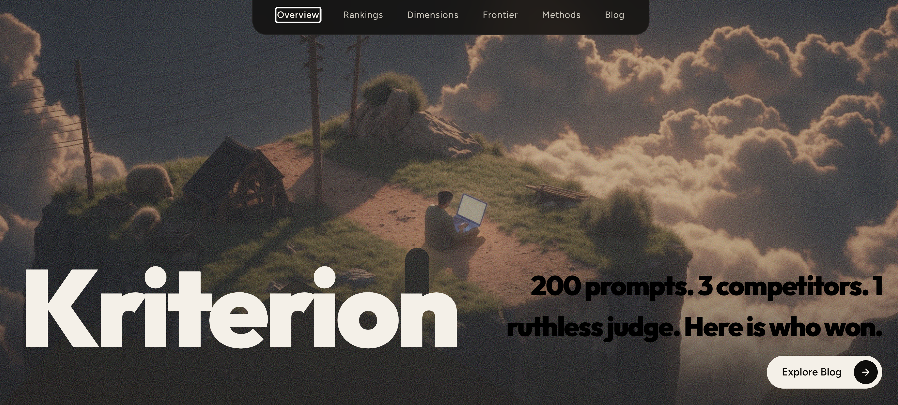

# Kriterion


> *200 prompts. 4 open-weight models. 4 evaluation dimensions.*
> *No human labels. Here's what the data showed.*



---

## 🔍 What This Is

This mirrors the evaluation work done by evals teams at Anthropic, Google, and OpenAI: systematic, auto-scored, and reproducible. Kriterion evaluates MiniMax M2.5, OpenAI GPT-OSS 20B, and OpenAI GPT-OSS 120B across 200 prompts using NVIDIA Nemotron 3 Super 120B as an independent external judge. Every score, chart, and finding in this dashboard is generated from real eval runs — no synthetic data.

---

## 🚀 Live Dashboard &nbsp;|&nbsp; 📝 Blog Post

[Live Dashboard →](https://kriterion-eight.vercel.app/) &nbsp;|&nbsp; [Blog Post →](https://kriterion-eight.vercel.app/blog)


---

## 🤖 Why These Models

tl;dr: [Blog Post →](https://kriterion-eight.vercel.app/blog)

### Evaluated Models

| Model | Provider | Parameters | Knowledge Cutoff | Why Selected |
|---|---|---|---|---|
| MiniMax M2.5 | MiniMax | 256B (MoE) | Sep 2024 | MoE routing to specialized expert subnetworks; latest MiniMax open-weight release |
| GPT-OSS 20B | OpenAI | 20B | Apr 2024 | Lightweight open-weight variant — tests whether a smaller model closes the gap |
| GPT-OSS 120B | OpenAI | 120B | Apr 2024 | Full-scale open-weight flagship; OpenAI's largest open-release at time of eval |

> All 3 evaluated models are the latest open-weight releases from their respective providers with the most recent knowledge cutoffs available on OpenRouter free tier.

### Judge Model: NVIDIA Nemotron 3 Super 120B

> **Why a separate judge?** Since all 3 evaluated models are open-weight models accessed via OpenRouter, using any of them as judge would create circularity: a model scoring its own output family. The judge must be architecturally independent from every model being evaluated.

Nemotron 3 Super was selected because:
- Architecturally independent from all 3 evaluated models (NVIDIA vs. OpenAI vs. MiniMax)
- No known training data overlap with GPT-OSS or MiniMax M2.5 fine-tuning corpora
- Latest open-weight NVIDIA release with a recent knowledge cutoff (Mar 2024)
- Proven reliability as a judge model — used in production by: OpenClaw, Kilo Code, Hermes Agent, and Claude Code

---

## 📐 Evaluation Design

| Dimension | Definition | Scoring Method | Limitation |
|---|---|---|---|
| **Factual Accuracy** | Claim accuracy across all verifiable assertions | Nemotron lists each claim TRUE/FALSE/UNVERIFIABLE; score = TRUE ÷ (TRUE + FALSE) | `null` when prompt has no verifiable claims; does not cross-validate against authoritative sources |
| **Reasoning Coherence** | Validity and depth of inferential steps | Nemotron marks each step VALID/INVALID/REDUNDANT; score = VALID ÷ (VALID + INVALID) | `null` for simple recall tasks; shallow-but-correct responses score ~0.85, not 1.00 |
| **Instruction Fidelity** | Explicit constraints satisfied ÷ total constraints | Score = constraints_met / constraints_total; partial credit per constraint; implied intent scored when none explicit | Subject to judge interpretation on ambiguous constraints |
| **Format Compliance** | Structural exactness against requested output format | Deterministic parser first (JSON.parse / regex / code-fence); judge called only for ambiguous edge cases | Binary pass/fail on deterministic cases may miss nuanced partial compliance |

**Scoring range:** 0.00 – 1.00. Most responses score 0.40–0.85; 1.00 reserved for perfect responses.

**Evaluator system prompt applied to all 3 models:**
```
You are a helpful, precise AI assistant. Answer the user's prompt directly.
Be concise. Be accurate. Follow all formatting instructions exactly.
If the prompt asks for a specific format (JSON, list, code), use that format only.
Do not add disclaimers, caveats, or meta-commentary about your response.
```

---

## 🏗️ Architecture

```
prompts/prompt_suite.json  (200 prompts × 5 categories)
            ↓
     batch_eval.py
     ├── calls MiniMax M2.5, GPT-OSS 20B, GPT-OSS 120B via OpenRouter
     ├── 50 calls/day budget → ~8-day run for all 600 pairs
     ├── atomic parquet write per row (crash-safe)
     └── auto-schedules next run via Windows Task Scheduler on quota exhaust
            ↓
     evaluator.py  (judge scoring)
     ├── sends each response to Nemotron 3 Super 120B
     ├── response truncated to 1,500 chars (~375 tokens) before judge
     └── returns JSON: {factuality, reasoning, instruction_following, format_compliance}
            ↓
     data/eval_results.parquet → eval_results.csv
            ↓
     leaderboard.py  →  data/leaderboard.csv
            ↓
     React + Tailwind + Recharts dashboard  (public/data/leaderboard.csv)
            ↓
     Vercel  (static deploy)
```

**Call accounting:**
```
200 prompts × 3 evaluators  =  600 evaluator calls
600 responses × 1 judge     =  600 judge calls
──────────────────────────────────────────────────
Total API calls:         1,200
Total dimension scores:  2,400
Total cost:              $0.00
```

---

## 📊 Results

© Kriterion Portfolio | Evaluation underway.
Results will be published upon completion.

> Results and screenshots updated after eval run completes.

---

## ⚙️ Run Locally

### Prerequisites

Windows 11 PowerShell · Python 3.11 · Node.js LTS

### Eval Harness (Python)

```powershell
git clone https://github.com/akstrek/kriterion-LLM-Evaluation-Framework.git
cd kriterion
python -m venv venv
.\venv\Scripts\Activate.ps1
pip install -r requirements.txt
# Add OPENROUTER_API_KEY=xxxx to .env

python generate_prompts.py  # generates prompts/prompt_suite.json
python evaluator.py --sample 2  # validates API connection — runs 2 sample prompts per model
python batch_eval.py        # ~24 days at 50 calls/day — checkpoints every call
python leaderboard.py       # run once batch_eval.py completes
```

### Dashboard (React)

```powershell
npm install
npm run dev                 # localhost:5173
```

Copy `data/leaderboard.csv` to `public/data/leaderboard.csv` for the dashboard to load real results. Without it, the dashboard falls back to demo data automatically.

### Environment Variables

```
OPENROUTER_API_KEY=xxxx     # all 4 model calls route through OpenRouter
```

---

## 💰 Cost

| Component | Calls | Cost |
|---|---|---|
| Evaluated models (3 × 200 prompts) | 600 | $0.00 (free tier) |
| Judge model (1 call per response) | 600 | $0.00 (free tier) |
| **Total** | **1,200** | **$0.00** |

> All models accessed via OpenRouter free tier. Upgrade path to any paid judge model available via `LLM_PROVIDER` env var in `config/llm.py`.

---

## 🔭 With Internal Eval Infrastructure

- Access to proprietary models would enable direct comparison against Claude 4, Gemini 2.5 Pro, and GPT-4o — not just open-weight proxies on a daily free-tier budget
- Human rater ground truth would cross-validate Nemotron judge scores and quantify per-dimension bias, turning directional findings into statistically grounded rankings
- Larger prompt diversity (1,000+ prompts across more categories, including multi-turn and tool-use scenarios) would surface failure modes invisible at 200 prompts and 5 categories

---

## ⚠️ Known Limitations

- **Judge circularity risk:** Nemotron 3 Super may exhibit bias toward outputs resembling its own training distribution — scores are not cross-validated against human raters
- **Prompt selection bias:** 200 prompts across 5 categories may not represent the full distribution of real-world use cases; adversarial edge cases are especially sensitive to prompt phrasing
- **Free tier consistency:** OpenRouter free tier models may exhibit response variability under rate limiting — per-provider 4s delays mitigate but do not eliminate this
- **No human validation baseline:** all scores are automated — treat findings as directional, not definitive
- **Single judge:** using one judge model introduces a fixed bias profile; multi-judge ensembling would reduce this at higher cost
- Upgrade path to any paid judge model documented in `config/llm.py` via `LLM_PROVIDER` env var

---

## 📁 Project Structure

```
kriterion/
├── batch_eval.py          # Sequential eval runner with checkpointing
├── evaluator.py           # Model calls + judge scoring
├── leaderboard.py         # Result aggregation and CSV output
├── config/llm.py          # OpenRouter handler, rate limiting, system prompts
├── prompts/
│   └── prompt_suite.json  # 200 evaluation prompts
├── data/                  # eval_results.csv + leaderboard.csv (post-run)
├── public/data/           # Static CSV served to React dashboard
├── src/
│   ├── components/
│   │   ├── charts/        # Recharts visualizations
│   │   ├── layout/        # Navbar, PageFrame, ScrollableZone, BottomLeft/Right
│   │   └── pages/         # Overview, Rankings, Dimensions, Frontier, Methods, Blog
│   └── lib/loadCsv.ts     # CSV loader with fallback demo data
├── project.md             # Architecture decisions + task log
└── requirements.txt
```

---

<div align="center">

Built by [akstrek](https://github.com/akstrek/kriterion) &nbsp;·&nbsp; [View on GitHub](https://github.com/akstrek/kriterion)

*Eval methodology documented in full on the [Blog page](https://kriterion.vercel.app/blog)*

</div>
